# Gated Progression — The Skill Tree

> **Game-design name for this:** *mastery-based progression on a prerequisite DAG*.
> Same idea as Duolingo's "sections", Khan Academy's mastery tree, or a Diablo skill tree.
> You cannot start a stage until its prerequisites are `COMPLETE`.
>
> **This file is bottom-up** — *what can I start next?* For the top-down view — *why does this
> stage matter?* — see [CAPABILITY_MAP.md](CAPABILITY_MAP.md), which traces stages up to the six
> capabilities a quant is hired for. Same stages, opposite direction. **This file owns
> sequencing; that one is reference only.**

---

## Stage lifecycle

```
LOCKED  →  UNLOCKED  →  IN_PROGRESS  →  READY_FOR_TEST  →  COMPLETE
                                                       ↘  FAILED_TEST → back to IN_PROGRESS
```

- **LOCKED**: at least one prereq is not COMPLETE.
- **UNLOCKED**: all prereqs COMPLETE. You may start.
- **IN_PROGRESS**: you're working on Learn / Feynman / Problems / Solvers.
- **READY_FOR_TEST**: all deliverables of `04_deliverables_spec.md` met.
- **COMPLETE**: unlock test passed (≥ 80% on fresh problems + oral napkin).
- **REGRESSED**: a review (+1w/+1m/+3m) failed → drop back to IN_PROGRESS, redo Feynman step 3–4.

Track state in `progress/stage_log.md` (one row per stage).

---

## Stage naming convention

**Adopted 2026-08-04**, replacing the old `T0.<letter>` / `S<n>.<m>` mix — which carried no depth
signal and whose section numbers did not actually match `topics/`.

```
<TYPE><section>.<subsection><split>
```

**TYPE — the depth class. This is the first character because it is the cost driver.**

| Type | Meaning | Budget multiplier (measured, S15) |
|---|---|---|
| `R` | **Refresher** — machinery you had once, being re-activated | ≈ **1.2×** |
| `F` | **Foundation** — new install, never held before | ≈ **2.0×** |
| `D` | **Deepen** — a section revisited later at greater depth | TBD (first one is S9.3) |

**section.subsection — indexes `topics/`, 1:1 with the Roman numerals.**

| # | `topics/` file | | # | `topics/` file |
|---|---|---|---|---|
| 1 | `section_I_probability_combinatorics` | | 8 | `section_VIII_calculus_des` |
| 2 | `section_II_classical_puzzles` | | 9 | `section_IX_statistics_estimation` |
| 3 | `section_III_markov_chains` | | 10 | `section_X_algorithms_ds` |
| 4 | `section_IV_continuous_time_processes` | | 11 | `section_XI_information_theory` |
| 5 | `section_V_stochastic_control` | | 12 | `section_XII_game_theory` |
| 6 | `section_VI_derivative_pricing` | | 13 | `section_XIII_measure_theory` |
| 7 | `section_VII_linear_algebra` | | | |

The subsection number is the **`##` heading number inside that file** — so `F1.4` means
`topics/section_I` §4 (*Discrete* RVs & Distributions) and `F1.5` means §5 (*Continuous* RVs &
Distributions). **Open the file and read the heading before assigning a number.** This has been
got wrong twice:

- `S1.3` was labelled "Discrete Distributions" while §3 is Conditional Probability *(fixed 08-04)*
- `F1.4a`/`F1.4b` assumed both distribution stages lived in §4. They don't — discrete is §4,
  continuous is §5. They were never a split of one subsection *(fixed 08-09)*

**split letter (optional)** — `a`/`b`/`c` **only** when one genuine `topics/` subsection is too
big for a day-stage. `F1.1a/b/c` (combinatorics over three days) is the real case. If two stages
map to two different subsections, they get two different numbers — not a split letter.

**Refreshers** use `R.<name>` (`R.calculus`, `R.linalg`) — they cut across sections rather than
sitting in one, so a section number would be a lie. `T0.A`/`T0.B` remain as-is: environment and
git setup, not study stages.

**Write the plain name first, ID as subscript:** "Continuous Distributions `F1.5`".

### Migration record (2026-08-04)

| Old | New |
|---|---|
| `T0.C` | `R.calculus` |
| `T0.D` | `R.linalg` |
| `S1.3` Discrete Distributions | `F1.4a` → **`F1.4`** *(§4 Discrete RVs; was mislabelled §3)* |
| `S1.5` Continuous Distributions | `F1.4b` → **`F1.5`** *(§5 Continuous RVs — a **different** subsection, corrected 08-09)* |
| `S1.1` Combinatorics | `F1.1` |
| `T1.X` Named Distributions | retired — split into `F1.4` + `F1.5` |

Still on the old scheme, renamed when scheduled: `S1.2`, `S1.6`, `S1.7`, `S1.8`, `S2.1`,
`S3.x`, `S4.x`, `S6.x`, `S9.x`, `S10.x`. Under the new rule most become `F<n>.<m>`; `S9.3`
regression is the first likely `D`.

---

## The DAG (interview-critical subset for a 5-month, near-zero-start plan)

Rendered in Mermaid. Nodes are stages; edges = prerequisites.

```mermaid
graph LR
    %% ============ FOUNDATIONS (Tier 0) ============
    T0A[T0.A Python + NumPy fluency]
    T0B[T0.B Git + repo hygiene]
    R_calculus[R.calculus Calculus refresher<br/>S8.1 ODE basics]
    R_linear_algebra[R.linalg Linear algebra refresher<br/>S7.1 eig/SVD/PD]

    %% ============ PROBABILITY CORE (Tier 1) ============
    F1_1[F1.1 Combinatorics]
    S1_2[S1.2 Cond prob + Bayes]
    F1_4[F1.4 Discrete Dists]
    F1_5[F1.5 Continuous Dists]
    S1_6[S1.6 Joint dists + MVN]
    S1_7[S1.7 Expectation, var, tower]
    S1_8[S1.8 MGF / char funcs]

    S2_1[S2 Classical puzzles<br/>dice/coin/urn/geom]

    %% ============ STATS (Tier 1.5) ============
    S9_1[S9.1 MLE + estimators]
    S9_2[S9.2 Hypothesis testing]
    S9_3[S9.3 Regression + time series]
    S9_4[S9.4 Bayesian]

    %% ============ PROCESSES (Tier 2) ============
    S3_1[S3.1 Finite Markov chains]
    S3_2[S3.2 Absorbing + first passage]
    S3_3[S3.3 Branching]

    S4_1[S4.1 Brownian motion]
    S4_2[S4.2 Martingales + OST]
    S4_3[S4.3 Ito + SDEs]
    S4_5[S4.5 Stopping times]

    %% ============ FINANCE (Tier 3) ============
    S6_1[S6.1 Binomial trees]
    S6_2[S6.2 Black-Scholes + Greeks]
    S6_3[S6.3 Exotics]
    S6_5[S6.5 Monte Carlo pricing]
    S8_2[S8.2 PDEs + Feynman-Kac]

    %% ============ ALGO / CODING (Tier X, parallel track) ============
    S10_1[S10.1 Arrays/strings/hash]
    S10_2[S10.2 DP]
    S10_3[S10.3 Graphs/BFS/DFS]
    S10_4[S10.4 Numerical methods]

    %% ============ ADVANCED (Tier 4, optional for Q1) ============
    S5[S5 Optimal stopping / DP]
    S11[S11 Info theory + Kelly]
    S13[S13 Measure theory + Girsanov]

    %% ============ CAPSTONES (map to project_roadmap.md) ============
    P1[P1 Options Pricer]:::proj
    P5[P5 Delta hedge sim]:::proj
    P16[P16 Regime detection]:::proj
    P18[P18 Exotic MC pricer]:::proj

    classDef proj fill:#fff2cc,stroke:#d6b656,stroke-width:2px

    %% ---- Edges ----
    T0A --> F1_1
    T0B --> F1_1
    R_calculus --> F1_5
    R_linear_algebra --> S1_6

    F1_1 --> S1_2 --> F1_4 --> F1_5 --> S1_6 --> S1_7 --> S1_8
    F1_1 --> S2_1
    S1_7 --> S2_1

    S1_7 --> S9_1 --> S9_2 --> S9_3 --> S9_4
    S1_6 --> S9_3

    F1_4 --> S3_1 --> S3_2 --> S3_3
    S1_7 --> S3_1

    F1_5 --> S4_1 --> S4_2 --> S4_3 --> S4_5
    S1_8 --> S4_1

    S4_3 --> S6_2
    S6_1 --> S6_2 --> S6_3
    S6_2 --> S6_5
    S8_2 --> S6_2
    R_calculus --> S8_2

    S6_2 -.capstone.-> P1
    S6_2 --> P5
    S3_1 -.capstone.-> P16
    S9_1 --> P16
    S6_5 -.capstone.-> P18
    S4_5 --> S6_3

    T0A --> S10_1 --> S10_2
    S10_1 --> S10_3
    S6_5 --> S10_4
    F1_5 --> S10_4

    S3_2 --> S5
    S1_7 --> S11
    S4_3 --> S13
```



---

## Recommended traversal for Q1-2027 target (25 weeks)

> ## ⚠️ THE 13-SPRINT TABLE BELOW IS STALE (as of 2026-08-04)
>
> The **DAG above is still correct** — dependency edges don't change. The **calendar has drifted**:
> Sprint 16's row lists R.calculus/R.linalg/`F1.1` start, but the refreshers were done in S15's
> tail. `F1.5` sits in Sprint 19 here and is actually being studied 2026-08-05.
>
> **Deliberately not rewritten yet.** Re-baselining 13 sprints on one sprint of velocity data
> would produce a second fiction. **Scheduled rewrite: S16 retro, 2026-08-16**, when two sprints
> and a tested 2.0× multiplier exist. Until then, `progress/sprints/S<NN>.md` is the truth for
> anything inside the current sprint; this table is directional only.

**Role target (from `05_commitment_contract.md` §B):** Buy-side QR / systematic PM (primary) + HFT / market-making (secondary).

**Sprint alignment:** the plan runs across **13 two-week sprints** (Sprint 15 → Sprint 27), matching the user's existing personal-agile cadence. Sprint 15 (started 2026-07-20, mid-sprint at time of planning) is treated as **Sprint 0 — setup only**. Sprint 27 ends 2027-01-17, two days after the Jan 15 interview target.

### Common tier vs. specialisation — when do you actually pick a class?

**You are pre-occupation, and that is by design.** Everything from here through roughly Sprint 22
— probability, distributions, Markov chains, linear algebra, early stats, algorithms — is
**common tier**. No question in it is answered differently by a buy-side QR and an HFT
market-maker. It is the baseline of academic supply that every quant, front or mid office, buy
or sell side, is assumed to have. Nobody gets to choose a specialisation *instead* of it.

So the ⬆️/⬇️ table below is doing something subtler than it appears. **It is not selecting
different content — it is deciding how many sprints each common subject gets.** S9 and S10 are
weighted up because *both* target roles need them and the baseline scored ~1.0 there, not
because they are QR-specific or HFT-specific.

**The fork is Sprint 21 (the mid-checkpoint), and it is a weighting decision, not a new syllabus:**

| | Common tier (now → ~S22) | Where it forks (S23 →) |
|---|---|---|
| **Buy-side QR** | identical | S9 depth: regression, GARCH, cointegration · Bayesian · P16 regime detection |
| **HFT / MM** | identical | S10 depth: graphs, DP, LC-medium · microstructure · Poisson arrivals, queue dynamics |

By Sprint 21 you will have probability, Markov, linear algebra and early stats in hand, plus two
more sprints of velocity data — enough to tilt the back half deliberately rather than by default.
**Until then, "am I studying the right thing for QR vs HFT?" is not a live question.** The honest
answer is that both need everything currently scheduled, and depth in the common tier is what
makes either fork reachable.

*(Framing adopted from the user's own analogy, 2026-08-04: hone the fundamentals to level 18, then
choose the occupation. The levels are real; the class choice is genuinely deferred.)*

### What this target changes vs. a generic desk-strat plan

| Emphasis | Why |
|---|---|
| ⬆️ **S9 Statistics** (regression, time series, GARCH, Bayesian) | Buy-side QR is 60% applied stats. Signal generation, backtesting, factor models all live here. |
| ⬆️ **S10 Algorithms & DS** — pulled earlier and deepened | HFT/MM screens are algo-heavy (LeetCode medium/hard, C++/Python fluency). Also gates numerical work. |
| ⬆️ **S1 Probability** — depth over breadth | Both target roles interview on probability puzzles ruthlessly. Optiver/JS/SIG/Jump-style. |
| ⬆️ **S3 Markov + S4 BM/martingales** | Core for both HFT (queue dynamics, Poisson processes) and QR (regime models, mean reversion). |
| ⬆️ **S7 Linear algebra + PCA** | Factor models, covariance estimation, portfolio construction. |
| ➡️ **S6 Derivatives** — narrowed to S6.1 (binomial), S6.2 (BS/Greeks), S6.5 (MC) only | Still asked in interviews but not the differentiator for these roles. |
| ⬇️ **S6.3 Exotics, S6.4 Rates models** — deferred to backlog | Sell-side structuring territory; not on the critical path. |
| ⬇️ **STS-specific projects P6–P20** — mostly deferred | Built for a desk-strat role you're no longer targeting. Only P1, P5, P16, P18 survive as capstones. |
| ➕ **New: microstructure primer** (S4.4-lite + Almgren-Chriss) | HFT/MM won't hire without at least conversational fluency. Fits inside S4/S10 stages. |
| ➕ **New: mock interview cadence** starting Week 18 | Confidence (your internal success metric) requires repetition under pressure, not just knowledge. |

### 13-sprint traversal (revised for buy-side QR + HFT, sprint-aligned)

Weeks reference the working weeks within each sprint (W1 = week 1 of sprint, W2 = week 2).

| Sprint | Dates | Focus | Sprint goal / demo |
|---|---|---|---|
| **15** (setup) | 2026-07-20 → 08-02 | **Baseline test** (this weekend) · T0.A Python env · T0.B Git repo hygiene · read all 6 learning-system files · fill `05_commitment_contract.md` A+B (done) | Repo scaffolded, baseline scores logged, Sprint 16 planned |
| **16** | 08-03 → 08-16 | Calculus refresher `R.calculus` · Linear algebra refresher `R.linalg` · S1.1 Combinatorics (start) | 2 refresher notes + S1.1 Feynman note started |
| **17** | 08-17 → 08-30 | `F1.2` Cond prob + Bayes · **`F1.7a`/`F1.7b` Expectation + tower, split (PULLED FORWARD)** · S10.1 scrap-tier only | `F1.2` + `F1.7a` + `F1.7b` COMPLETE · 4 LC-easy done — see `sprints/S17.md` for the authoritative day-by-day (written 08-15) |
| **18** | 08-31 → 09-13 | S1.4 Discrete RVs · S10.1 cont'd · S10.2 DP intro | S1.4 COMPLETE · 20 LC-easy total · first DP problems |
| **19** | 09-14 → 09-27 | F1.5 Continuous RVs · S10.3 graphs (BFS/DFS) | `F1.5` COMPLETE · graph solvers |
| **20** | 09-28 → 10-11 | S1.6 Joint dists + MVN · S7 Linear algebra deepen (PCA) | S1.6 COMPLETE · PCA on toy covariance |
| **21** | 10-12 → 10-25 | S1.8 MGF · S2.1 classical puzzles · **MID-CHECKPOINT retest (W2 Sat)** | S1.8 + S2.1 COMPLETE · radar chart update · adjust Sprints 22–27 |
| **22** | 10-26 → 11-08 | S1.8 MGF · S10.2 DP deepen · S3.1 Finite Markov chains (start) | S1.8 COMPLETE · 5 LC-medium |
| **23** | 11-09 → 11-22 | S3.1 Markov (complete) · S3.2 Absorbing + first passage · S9.1 MLE | S3.1 + S3.2 + S9.1 COMPLETE · gambler's ruin solver |
| **24** | 11-23 → 12-06 | S9.2 Hypothesis testing · S9.3 Regression + time series (AR/MA/ARMA) | S9.2 COMPLETE · regression notebook on real data |
| **25** | 12-07 → 12-20 | S9.3 GARCH + cointegration · S4.1 Brownian motion · microstructure primer | S9.3 COMPLETE · GARCH(1,1) impl · BM simulator |
| **26** | 12-21 → 2027-01-03 | S4.2 Martingales + OST · S4.3 Ito + SDEs · S6.1 Binomial · S6.2 BS/Greeks → **Capstone P1** · **Mock #1 (prob)** | P1 shipped · S4.2, S4.3, S6.1, S6.2 COMPLETE · mock logged |
| **27** | 2027-01-04 → 01-17 | S6.5 MC pricing · S9.4 Bayesian → **Capstone P16** (HMM regime) · **Mocks #2, #3, #4** (coding + prob + full loop) · weakness triage · **FINAL RETEST** | P16 shipped · 4 mocks logged · ready for Jan 15 |

**Interview date (2027-01-15) falls on Day 12 of Sprint 27** — the last mocks + retest should complete on Day 10–11 to leave 3–4 days for rest and light review before walk-in.

### Realism check on the compressed plan

Sprints 26 and 27 are the highest-risk — they compress S4 (BM/martingales/Ito), S6 (Binomial/BS/MC), and two capstones + 4 mocks into 4 weeks. Two contingencies:

- **If Sprint 21 mid-checkpoint shows >2 stages behind:** drop S6.5 MC + P16 capstone from Sprint 27, keep P1 only, defer regime detection to post-Q1.
- **If baseline scores show S9 or S7 are already ≥ 3.6:** free ~2 sprints of capacity that can be reinvested in S6 depth or a third mock cycle.

### Explicit deferrals (backlog — post-Q1 or if ahead of schedule)

- S3.3 Branching processes
- S3.4–3.5 HMM implementation, MCMC (S9.4 covers Bayesian intuition)
- S4.4 Poisson/jump processes (light coverage in Week 15 microstructure)
- S5 Optimal stopping / DP / HJB
- S6.3 Exotics, S6.4 Rates models
- S8.2 PDEs / Feynman-Kac (S6.2 covers what's interview-critical)
- S12 Game theory (except S12.2 auctions — 20 min read on Vickrey mid-Week 21)
- S13 Measure theory / Girsanov
- STS projects P2, P3, P4, P6–P15, P17, P19, P20

### Mock interview cadence (sprint-aligned)

Confidence is a *skill*, not a byproduct. Mocks are scheduled in specific sprints:

- **Sprint 26 (late Dec):** Mock #1 — probability, 45 min, AI interviewer
- **Sprint 27 (early Jan):** Mock #2 — coding, 45 min, LC-medium live-coded aloud
- **Sprint 27 (mid Jan):** Mock #3 — mixed prob + brainteaser
- **Sprint 27 (Day 10–11):** Mock #4 — full simulated first-round loop

Log each in `progress/mocks/YYYY-MM-DD_<topic>.md` with: questions, your answers, gaps identified, **confidence score 1–5**. The confidence trend line is your real progress bar.

---

### Baseline-driven adjustments (from Sittings 1+2, 2026-07-23/24)

Based on `progress/baseline_scores.md` (combined mean 0.88, no section > 1.5, no acceleration):

**From Sitting 1:**
1. **S1.7 pulled forward** from Sprint 21 → Sprint 17. Tower property blocks S3 and S9; delaying was a design error.
2. **Sprint 16 gains a "Named distributions" Feynman note** (Bernoulli/Binomial/Geometric/Poisson/Uniform/Exp/Normal/Log-normal/χ²). Cheapest single-point improvement to Section I.
3. **Sprint 16 gains a 30-min "Bayes vocabulary + medical-test" block**. I.2 blocked by vocabulary alone.
4. **R.linalg linear algebra refresher extended** to eigenvalue computation by hand for 2×2 / 3×3.
5. **Sprint 17 carries three stages** (S1.1 + S1.2 + S1.7) — at sprint sizing ceiling; watch Sprint 16 velocity first.

**From Sitting 2 (new):**
6. **R.calculus calculus refresher expanded and made mandatory-deep** — must cover: ODEs (separable + linear first-order, esp. dy/dx=y ↔ y=eˣ), Lagrange multipliers, chain rule. Feynman note required. VIII.1 answered wrong = red flag.
7. **Sprint 17 S10.1 explicitly includes hash-map pattern** (Two-sum, contains-duplicate, group-anagrams). Complexity annotations mandatory.
8. **Sprint 19 S10.3 (graphs/BFS/DFS) upgraded from "parallel" to primary focus** — BFS being unknown is a critical HFT-screen blocker.
9. **Every solver from Sprint 17 onward requires docstring with time + space complexity** (added to D3 in `04_deliverables_spec.md`). X.1 lost points for wrong complexity despite correct answer.
10. **"Cheap wins" mini-stage in Sprint 16** — 30-min blocks per topic on vocabulary-only zero-scorers: Bayes disease-test, coupon collector formula, put-call parity direction, Vickrey auction, Shannon entropy formula. Total ~2.5 h for ~5-point score jump.
11. **Sections IX and X are both critical-path and both scored ~1.0** — no acceleration possible. Sprints 23–25 (stats) and Sprints 17–22 (algo parallel) run at full sprint capacity, no shortcuts.
