# Capability Map — what all this is *for*

> **The question this file answers:** "I'm deriving `E[Exp(λ)] = 1/λ` on a Wednesday evening.
> What does that have to do with being a quant?"
>
> [vault/method/progression.md](vault/method/progression.md) is **bottom-up**: what can I start next,
> given prerequisites. This file is **top-down**: which real capabilities am I building, and
> which stages feed them. Same stages, opposite direction.
>
> ⚠️ **This is reference, not a plan.** It never drives sequencing — the DAG does that. Two
> competing calendars is exactly what made the DAG's traversal table go stale.
>
> **Generated, not hand-maintained.** The diagram and the coverage table below are built from
> frontmatter by `vault/build_capability_map.py`. Run it after writing a stage map, and at each
> sprint retro. Editing between the `GENERATED` markers by hand will be overwritten.

---

## The map

**Four columns, left to right.** Every strand reads as a sentence:

> **stage** you study → *(concept)* that carries the idea → **application** you could build → **role** that pays for it

- **Stages** come from `stage_maps/*.md`. `✅` = closed or ready-for-test.
- **Concepts** *(rounded, dashed)* appear where they explain a jump a stage title doesn't. A stage
  naming a role with no concept between them draws a direct arrow instead — concepts are not a
  layer everything must pass through.
- **Applications** are the concrete things a quant builds, and the things you can point at in an
  interview.

An arrow exists because a file's frontmatter says so. **If a strand looks wrong, fix the
frontmatter, not the diagram.** The generator also reports dangling links — a `[[concept]]` with
no note behind it — which is how the whole graph was silently disconnected until 2026-08-16.

Wide by design; pan and zoom.

```mermaid
graph LR
    classDef stage fill:#f5f5f5,stroke:#666,stroke-width:1px
    classDef concept fill:#fffbe6,stroke:#b8860b,stroke-width:1.5px,stroke-dasharray:4 3
    classDef app fill:#dae8fc,stroke:#6c8ebf,stroke-width:1.5px
    classDef role fill:#e1d5e7,stroke:#9673a6,stroke-width:3px

    SF11Combinatorics["Combinatorics ~"]:::stage
    SF12ConditionalProbabilit["Conditional Probability & Bayes"]:::stage
    SF14DiscreteDistributions["Discrete Distributions ✅"]:::stage
    SF15ContinuousDistributio["Continuous Distributions ✅"]:::stage
    SF17ExpectationVarianceMo["Expectation, Variance and Moments"]:::stage
    SRCalculus["Calculus Refresher ✅"]:::stage
    SRLinearAlgebra["Linear Algebra Refresher ✅"]:::stage
    CBaseRateFallacy("base rate fallacy"):::concept
    CBayesRule("Bayes' rule"):::concept
    CBiasVariance("bias variance"):::concept
    CBijectionProof("proof by bijection"):::concept
    CChangeOfVariables("change of variables"):::concept
    CComplementaryCounting("complementary counting"):::concept
    CConditionalInformation("conditional information"):::concept
    CFatTails("fat tails"):::concept
    CFirstStepConditioning("first step conditioning"):::concept
    CInclusionExclusion("inclusion-exclusion"):::concept
    CItosLemma("itos lemma"):::concept
    CJensenInequality("Jensen's inequality"):::concept
    CLawOfTotalProbability("law of total probability"):::concept
    CLinearityOfExpectation("linearity of expectation"):::concept
    CMeanReversion("mean reversion"):::concept
    CMemorylessness("memorylessness"):::concept
    CMomentGeneratingFunction("moment generating function"):::concept
    CMultinomialCoefficient("multinomial coefficient"):::concept
    COrderBookMechanics("order book mechanics"):::concept
    COrderedVsUnordered("ordered vs unordered"):::concept
    CPoissonExponentialDualit("poisson exponential duality"):::concept
    CPsdCovariance("psd covariance"):::concept
    CRiskNeutralReplication("risk neutral replication"):::concept
    CStandardisation("standardisation"):::concept
    CTowerProperty("tower property"):::concept
    AAdverseSelection["Adverse selection"]:::app
    AAlphaDecay["Alpha decay analysis"]:::app
    AArrivalModelling["Arrival modelling"]:::app
    ABacktestEngine["Backtest engine"]:::app
    ABlackScholesPricer["Black-Scholes pricer"]:::app
    ACodingScreen["Coding screen (LC medium/hard)"]:::app
    ACovarianceEstimation["Covariance estimation"]:::app
    ADataPipeline["Data pipeline"]:::app
    AExecutionTca["Execution and TCA"]:::app
    AFactorModel["Factor model / PCA"]:::app
    AFeatureConstruction["Feature construction"]:::app
    AGreeksDeltaHedging["Greeks / delta hedging"]:::app
    AInventoryManagement["Inventory management"]:::app
    AKellySizing["Kelly bet sizing"]:::app
    AMarketStructure["Market structure"]:::app
    AMeanVarianceOptimiser["Mean-variance optimiser"]:::app
    AMonteCarloPricer["Monte Carlo pricer"]:::app
    ARiskAttribution["Risk attribution"]:::app
    ARiskParity["Risk parity allocation"]:::app
    AScenarioPnl["Scenario P&L"]:::app
    ASignalTesting["Signal + significance testing"]:::app
    AStressTesting["Stress testing"]:::app
    ATimeToFill["Time-to-fill / queue position"]:::app
    AVarTailRisk["VaR / tail risk"]:::app
    AVolSurface["Vol surface"]:::app
    AVolatilityModelling["Volatility modelling"]:::app
    RBacktestingInfra(["BACKTESTING AND INFRASTRUCTURE"]):::role
    RMarketMaking(["MARKET MAKING AND EXECUTION"]):::role
    ROptionsPricing(["OPTIONS PRICING AND HEDGING"]):::role
    RPortfolioConstruction(["PORTFOLIO CONSTRUCTION"]):::role
    RRiskManagement(["RISK MANAGEMENT"]):::role
    RSignalResearch(["SIGNAL RESEARCH"]):::role

    AAdverseSelection --> RMarketMaking
    AAlphaDecay --> RSignalResearch
    AArrivalModelling --> RMarketMaking
    ABacktestEngine --> RBacktestingInfra
    ABlackScholesPricer --> ROptionsPricing
    ACodingScreen --> RBacktestingInfra
    ACodingScreen --> RMarketMaking
    ACovarianceEstimation --> RPortfolioConstruction
    ADataPipeline --> RBacktestingInfra
    AExecutionTca --> RMarketMaking
    AFactorModel --> RPortfolioConstruction
    AFactorModel --> RSignalResearch
    AFeatureConstruction --> RSignalResearch
    AGreeksDeltaHedging --> ROptionsPricing
    AGreeksDeltaHedging --> RRiskManagement
    AInventoryManagement --> RMarketMaking
    AKellySizing --> RMarketMaking
    AKellySizing --> RPortfolioConstruction
    AMarketStructure --> RMarketMaking
    AMeanVarianceOptimiser --> RPortfolioConstruction
    AMonteCarloPricer --> RBacktestingInfra
    AMonteCarloPricer --> ROptionsPricing
    ARiskAttribution --> RRiskManagement
    ARiskParity --> RPortfolioConstruction
    AScenarioPnl --> RRiskManagement
    ASignalTesting --> RSignalResearch
    AStressTesting --> RRiskManagement
    ATimeToFill --> RMarketMaking
    AVarTailRisk --> RRiskManagement
    AVolSurface --> ROptionsPricing
    AVolatilityModelling --> RRiskManagement
    CBaseRateFallacy --> ASignalTesting
    CBayesRule --> AAdverseSelection
    CBayesRule --> ASignalTesting
    CBiasVariance --> AAlphaDecay
    CBiasVariance --> ASignalTesting
    CBijectionProof --> ASignalTesting
    CChangeOfVariables --> ABlackScholesPricer
    CComplementaryCounting --> ATimeToFill
    CConditionalInformation --> AAdverseSelection
    CFatTails --> AScenarioPnl
    CFatTails --> AStressTesting
    CFatTails --> AVarTailRisk
    CFatTails --> AVolatilityModelling
    CFirstStepConditioning --> ATimeToFill
    CInclusionExclusion --> ASignalTesting
    CItosLemma --> ABlackScholesPricer
    CJensenInequality --> ABlackScholesPricer
    CJensenInequality --> AKellySizing
    CLawOfTotalProbability --> ASignalTesting
    CLinearityOfExpectation --> ASignalTesting
    CLinearityOfExpectation --> ATimeToFill
    CMeanReversion --> AExecutionTca
    CMeanReversion --> AInventoryManagement
    CMemorylessness --> ATimeToFill
    CMomentGeneratingFunction --> AVarTailRisk
    CMultinomialCoefficient --> ASignalTesting
    COrderBookMechanics --> AMarketStructure
    COrderedVsUnordered --> ASignalTesting
    CPoissonExponentialDualit --> AArrivalModelling
    CPsdCovariance --> ACovarianceEstimation
    CPsdCovariance --> AFactorModel
    CPsdCovariance --> AMeanVarianceOptimiser
    CPsdCovariance --> ARiskAttribution
    CPsdCovariance --> ARiskParity
    CRiskNeutralReplication --> ABlackScholesPricer
    CStandardisation --> AFeatureConstruction
    CStandardisation --> AVarTailRisk
    CTowerProperty --> ASignalTesting
    SF11Combinatorics --> CBijectionProof
    SF11Combinatorics --> CComplementaryCounting
    SF11Combinatorics --> CInclusionExclusion
    SF11Combinatorics --> CMultinomialCoefficient
    SF11Combinatorics --> COrderedVsUnordered
    SF12ConditionalProbabilit --> CBaseRateFallacy
    SF12ConditionalProbabilit --> CBayesRule
    SF12ConditionalProbabilit --> CLawOfTotalProbability
    SF14DiscreteDistributions --> CFirstStepConditioning
    SF14DiscreteDistributions --> CLinearityOfExpectation
    SF14DiscreteDistributions --> CMemorylessness
    SF14DiscreteDistributions --> CPoissonExponentialDualit
    SF15ContinuousDistributio --> CChangeOfVariables
    SF15ContinuousDistributio --> CMemorylessness
    SF15ContinuousDistributio --> CPoissonExponentialDualit
    SF15ContinuousDistributio --> CStandardisation
    SF17ExpectationVarianceMo --> CFirstStepConditioning
    SF17ExpectationVarianceMo --> CJensenInequality
    SF17ExpectationVarianceMo --> CLinearityOfExpectation
    SF17ExpectationVarianceMo --> CMomentGeneratingFunction
    SF17ExpectationVarianceMo --> CTowerProperty
    SRCalculus --> CItosLemma
    SRLinearAlgebra --> CPsdCovariance
```

<!-- BEGIN GENERATED:diagram -->

<!-- END GENERATED:diagram -->

### Reading it — the chain that started this

```
F1.5 exponential ──► (memorylessness) ──► time-to-fill / queue position ──► MARKET MAKING
```

Memorylessness says a quote that has waited 10 seconds is no more "due" a fill than a fresh one.
That property *is* the model for time-to-next-trade, and `min(X,Y) ~ Exp(λ₁+λ₂)` is
first-to-fill across two venues. The same Wednesday also runs:

```
F1.5 normal    ──► (standardisation) ──► VaR / tail risk    ──► RISK MANAGEMENT
F1.5 uniform   ─────────────────────────► Monte Carlo pricer ──► OPTIONS PRICING
F1.5 normal    ──► (change of variables → log-normal) ──► Black-Scholes ──► OPTIONS PRICING
```

**Four roles from one stage.** That is the thing worth carrying into the study block: you are not
learning "the exponential distribution", you are learning the fill-time model, and the same
afternoon buys you the tail-risk and pricing machinery.

**Nodes feeding 3+ arrows are load-bearing** — `tower property`, `linearity of expectation`,
`change of variables`, `PSD`. They are the last things to cut when a sprint is under pressure.
`tower property` is baseline I.5, scored **0**, and it reaches pricing, signal research and risk
— which is independent confirmation that pulling it forward to S17 (Adjustment #1) was right.

---

## Coverage by role

> Generated from frontmatter. **Stages mapped** counts stage maps naming that role; **closed**
> counts those past `ready-for-test`. A low count is a statement about the calendar, not the plan.

<!-- BEGIN GENERATED:status -->
| Role | Stages closed | Stages mapped | Applications |
|---|---:|---:|---|
| **Backtesting and infrastructure** | 0 | 0 | [[backtest-engine]] · [[coding-screen]] · [[data-pipeline]] · [[monte-carlo-pricer]] |
| **Market making and execution** | 2 | 5 | [[adverse-selection]] · [[arrival-modelling]] · [[coding-screen]] · [[execution-tca]] · [[inventory-management]] · [[kelly-sizing]] · [[market-structure]] · [[time-to-fill]] |
| **Options pricing and hedging** | 2 | 2 | [[black-scholes-pricer]] · [[greeks-delta-hedging]] · [[monte-carlo-pricer]] · [[vol-surface]] |
| **Portfolio construction** | 1 | 1 | [[covariance-estimation]] · [[factor-model]] · [[kelly-sizing]] · [[mean-variance-optimiser]] · [[risk-parity]] |
| **Risk management** | 1 | 2 | [[greeks-delta-hedging]] · [[risk-attribution]] · [[scenario-pnl]] · [[stress-testing]] · [[var-tail-risk]] · [[volatility-modelling]] |
| **Signal research** | 1 | 4 | [[alpha-decay]] · [[factor-model]] · [[feature-construction]] · [[signal-testing]] |
<!-- END GENERATED:status -->

Each role note in `vault/roles/` carries its own live Dataview of the stages feeding it, plus the
interview form and work form. This table is the summary; the note is the detail.

---

## The fork (Sprint 21)

You are **pre-occupation**. Everything scheduled through roughly Sprint 22 is common tier — no
question in it is answered differently by a buy-side QR and an HFT market maker.

The map above deliberately shows **all six capabilities in full**, including the ones a given role
weights less, so the Sprint-21 decision is made against a complete picture rather than by default.

**Nothing in the diagram is colour-coded by role.** An earlier version shaded capabilities by
QR/HFT tilt; that was dropped 2026-08-09 because it read as a verdict on which branch is
"real" — market making is a first-class quant role, and plenty of MM desks are options desks.
The tilt is a scheduling weight, described in the table below, not a property of the work.

| | Weighted UP | Still required |
|---|---|---|
| **Buy-side QR** | Signal research · Portfolio construction · Backtesting | Options pricing, risk, and enough market-microstructure literacy to not sound naive |
| **HFT / MM** | Market making · Computation-heavy stages (S10.x) · Arrival modelling | Options pricing (many MM desks are options desks), risk, statistics |

**What the fork actually changes:** how many sprints each capability gets in S23–S27 — not which
ones exist. Nobody gets to skip a column.

---

## How to use this file

- **When a stage feels pointless**, find it in the diagram and follow the arrows up. If it doesn't
  reach a capability you care about, that is worth raising — it may genuinely be cuttable.
- **At the Sprint-21 mid-checkpoint**, read the status counts. They are a progress bar against
  things you actually want, rather than against stage counts.
- **Do not schedule from this file.** The DAG owns order; this owns motivation.

**To regenerate:**

```
python vault/build_capability_map.py
```

Reads every stage map and vault note, rewrites the two generated blocks, and prints any dangling
link it found. Run it after writing a stage map and at each sprint retro. `--demo` runs its
self-check.
