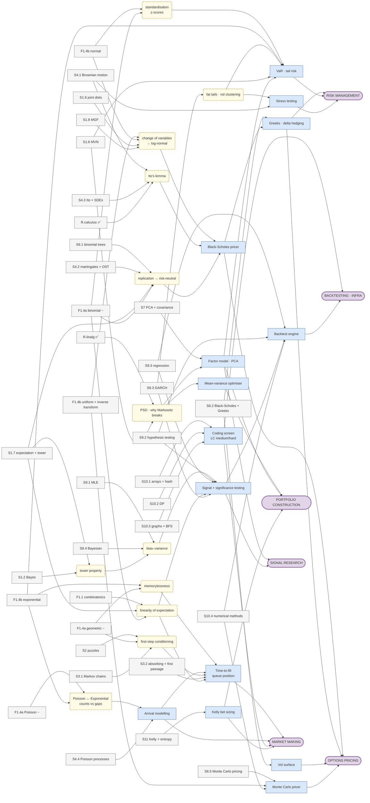

# Capability Map — what all this is *for*

> **The question this file answers:** "I'm deriving `E[Exp(λ)] = 1/λ` on a Wednesday evening.
> What does that have to do with being a quant?"
>
> [03_gated_progression.md](03_gated_progression.md) is **bottom-up**: what can I start next,
> given prerequisites. This file is **top-down**: which real capabilities am I building, and
> which stages feed them. Same stages, opposite direction.
>
> ⚠️ **This is reference, not a plan.** It never drives sequencing — the DAG does that. Two
> competing calendars is exactly what made the DAG's traversal table go stale.
>
> **Last updated:** 2026-08-09

---

## The map

**Four columns, left to right.** Every strand reads as a sentence:

> **stage** you study → *(concept)* that carries the idea → **application** you could build → **role** that pays for it

- **Stages** are split to sub-topic level, matching the stage maps — `F1.5` appears as
  *uniform*, *exponential* and *normal* separately, because they feed different capabilities by
  different routes.
- **Concepts** *(rounded, dashed)* appear **only where they explain a jump** a stage title
  doesn't. `S10.1 → coding screen` needs no concept in between. They are not a layer everything
  must pass through.
- **Applications** are the concrete things a quant builds — and the things you can point at in
  an interview.

Wide by design; pan and zoom. No containers, so strands stay traceable.



### Reading it — the chain that started this

```
F1.5 exponential ──► (memorylessness) ──► time-to-fill / queue position ──► MARKET MAKING
```

Memorylessness says a quote that has waited 10 seconds is no more "due" a fill than a fresh one.
That property *is* the model for time-to-next-trade, and `min(X,Y) ~ Exp(λ₁+λ₂)` is
first-to-fill across two venues. The same Wednesday also runs:

```
F1.5 normal    ──► (standardisation) ──► VaR / tail risk    ──► RISK MANAGEMENT
F1.5 uniform   ─────────────────────────► Monte Carlo pricer ──► OPTIONS PRICING
F1.5 normal    ──► (change of variables → log-normal) ──► Black-Scholes ──► OPTIONS PRICING
```

**Four roles from one stage.** That is the thing worth carrying into the study block: you are not
learning "the exponential distribution", you are learning the fill-time model, and the same
afternoon buys you the tail-risk and pricing machinery.

**Nodes feeding 3+ arrows are load-bearing** — `tower property`, `linearity of expectation`,
`change of variables`, `PSD`. They are the last things to cut when a sprint is under pressure.
`tower property` is baseline I.5, scored **0**, and it reaches pricing, signal research and risk
— which is independent confirmation that pulling it forward to S17 (Adjustment #1) was right.

---

## The capabilities, one table each

**Status** counts stages closed / stages listed. `✅` closed · `~` partial · blank = not started.

### Options pricing and hedging

| | |
|---|---|
| **What it is** | Given a contract, produce a price and the sensitivities that let you hedge it. |
| **Interview form** | "Price a European call." · "What's delta on a 1-week ATM vs a 1-year ATM?" · "Why is gamma highest near expiry?" |
| **Work form** | Pricing library, Greeks engine, vol surface, hedge P&L attribution |
| **Capstone** | **P1 Options Pricer** (Sprint 26) |
| **Stages** | R.calculus ✅ · F1.5 · S1.6 · S1.8 · S4.1 · S4.2 · S4.3 · S6.1 · S6.2 · S6.5 |
| **Key concepts** | change of variables → log-normal · replication → risk-neutral · Ito's lemma |
| **Applications** | Black-Scholes pricer · Greeks / delta hedging · vol surface · Monte Carlo pricer |
| **Status** | **1 / 10** |

*Baseline signal:* VI.3 (Greeks intuition) scored **3** — your best derivative answer, and it was
pure reasoning. VI.1 (binomial call) scored 0. The intuition is there; the machinery isn't.

### Portfolio construction

| | |
|---|---|
| **What it is** | Turn a set of return forecasts and a covariance estimate into position sizes. |
| **Interview form** | "What does a covariance matrix have to satisfy?" · "Why does Markowitz blow up in practice?" · "How would you size a bet with edge?" |
| **Work form** | Mean-variance / risk-parity optimisers, factor models, shrinkage, position limits |
| **Stages** | R.linalg ✅ · S1.6 · S7 · S9.3 · S11 (Kelly) |
| **Key concepts** | PSD · why Markowitz breaks |
| **Applications** | Mean-variance optimiser · factor model / PCA · Kelly bet sizing |
| **Status** | **1 / 5** |

*Already banked:* your `R.linalg` note derived why Σ is PSD **and** why it's PSD-not-PD — the
singular case that breaks Cholesky and naive Markowitz. That is a portfolio-construction insight
sitting in a linear algebra note.

### Signal research

| | |
|---|---|
| **What it is** | Find something that predicts returns, and establish it isn't noise. |
| **Interview form** | "How do you know this signal isn't overfit?" · "What are the OLS assumptions?" · "What's the difference between in-sample and out-of-sample R²?" |
| **Work form** | Feature construction, regression, multiple-testing control, decay analysis |
| **Stages** | F1.1 · S1.2 · S1.7 · S9.1 · S9.2 · S9.3 · S9.4 · S7 |
| **Key concepts** | bias–variance · tower property · linearity of expectation |
| **Applications** | Signal + significance testing · factor model · backtest engine |
| **Status** | **0 / 8** |

*Baseline signal:* Section IX scored **1.00** — joint lowest with algos, and this is the single
most QR-relevant capability on the list. MLE scored 0.

### Market making and execution

| | |
|---|---|
| **What it is** | Quote two-sided prices, manage inventory, and get filled at good prices. |
| **Interview form** | "Expected number of trades before your quote is hit?" · "What's your edge if you're picked off X% of the time?" · fast mental arithmetic, LC-medium under time pressure |
| **Work form** | Queue position modelling, adverse-selection cost, order routing, latency budgets |
| **Stages** | F1.4 ~ · F1.5 · S2 · S3.1 · S4.4 · S10.1 · S10.2 · S10.3 · S10.4 |
| **Key concepts** | memorylessness · Poisson ↔ Exponential (counts vs gaps) · first-step conditioning |
| **Applications** | Time-to-fill / queue position · arrival modelling · coding screen · Kelly sizing |
| **Status** | **0.5 / 9** |

*Baseline red flag:* X.4 — "don't know what BFS is." Named an HFT-screen blocker; S10.3 is the
primary focus of Sprint 19. **This capability is where the exponential distribution stops being
abstract**: memorylessness *is* the model for time-to-next-trade, and `min(X,Y) ~ Exp(λ₁+λ₂)` is
first-to-fill across venues.

### Risk management

| | |
|---|---|
| **What it is** | Quantify what you can lose, and know where the estimate fails. |
| **Interview form** | "Compute 99% 1-day VaR." · "Why is VaR not coherent?" · "What breaks when returns aren't normal?" |
| **Work form** | VaR / ES, stress testing, factor risk decomposition, tail modelling |
| **Stages** | F1.5 · S1.6 · S7 · S9.2 · S9.3 · S4.2 |
| **Key concepts** | standardisation / z-scores · fat tails · vol clustering |
| **Applications** | VaR / tail risk · stress testing · factor risk · delta hedging |
| **Status** | **0 / 6** |

*Note the direct line from Wednesday's stage:* 1.645 vs 1.96 vs 2.326 is a VaR calculation, and
mixing them up is a production bug, not a quiz slip. `Var > E` breaking the Poisson fit is why
naive arrival models understate tail risk.

### Backtesting and infrastructure

| | |
|---|---|
| **What it is** | Simulate a strategy on history without lying to yourself. |
| **Interview form** | Less directly asked — shows up as "how would you test that?" and in code screens |
| **Work form** | Event-driven backtesters, look-ahead / survivorship control, transaction costs, reproducibility |
| **Stages** | S9.2 · S9.3 · S10.1 · S10.2 · S10.4 · S6.5 |
| **Key concepts** | bias–variance (overfitting vs out-of-sample) |
| **Applications** | Backtest engine · coding screen · Monte Carlo convergence |
| **Status** | **0 / 6** |
| **Overlap credit** | Contract §A.1a — quantamental work touching §IX or §X **dual-counts** here. This is the one capability your 6h/week side project directly advances. |

---

## The fork (Sprint 21)

You are **pre-occupation**. Everything scheduled through roughly Sprint 22 is common tier — no
question in it is answered differently by a buy-side QR and an HFT market maker.

The map above deliberately shows **all six capabilities in full**, including the ones a given role
weights less, so the Sprint-21 decision is made against a complete picture rather than by default.

**Nothing in the diagram is colour-coded by role.** An earlier version shaded capabilities by
QR/HFT tilt; that was dropped 2026-08-09 because it read as a verdict on which branch is
"real" — market making is a first-class quant role, and plenty of MM desks are options desks.
The tilt is a scheduling weight, described in the table below, not a property of the work.

| | Weighted UP | Still required |
|---|---|---|
| **Buy-side QR** | Signal research · Portfolio construction · Backtesting | Options pricing, risk, and enough market-microstructure literacy to not sound naive |
| **HFT / MM** | Market making · Computation-heavy stages (S10.x) · Arrival modelling | Options pricing (many MM desks are options desks), risk, statistics |

**What the fork actually changes:** how many sprints each capability gets in S23–S27 — not which
ones exist. Nobody gets to skip a column.

---

## How to use this file

- **When a stage feels pointless**, find it in the diagram and follow the arrows up. If it doesn't
  reach a capability you care about, that is worth raising — it may genuinely be cuttable.
- **At the Sprint-21 mid-checkpoint**, read the status counts. They are a progress bar against
  things you actually want, rather than against stage counts.
- **Do not schedule from this file.** The DAG owns order; this owns motivation.

**Update cadence:** status counts at each sprint retro. Structure only when a stage is added or
dropped — the capability and competency layers should be near-static. If they churn, the target
is drifting.
